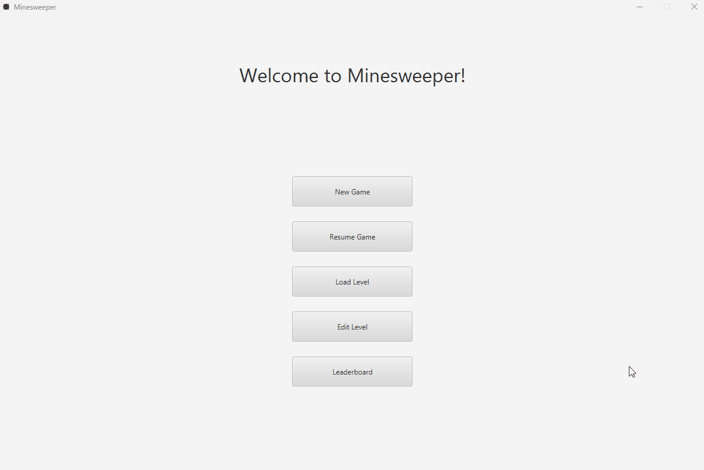

# Minesweeper 💣

---

A feature-rich Minesweeper game implementation in Scala 3 with JavaFX, featuring classic gameplay mechanics, custom level design, and advanced level editing capabilities using geometric transformations.

> 🎓 *Developed as a project for Functional Programming (13M111FP) at the University of Belgrade, School of Electrical Engineering*

---

## 🎮 Demo


## ✨ Features

### 🎮 Core Gameplay
- **Classic Minesweeper mechanics** - Flag mines, reveal cells, and clear the board
- **Multiple difficulty levels** - Easy, Medium, and Hard presets
- **Custom levels** - Create and play your own level designs
- **Timer and scoring system** - Track your performance and compete on leaderboards

### 🎨 Level Editor
- **Visual level designer** - Create custom Minesweeper boards with an intuitive interface
- **Geometric transformations** - Apply isometries to modify existing levels:
  - ↔️ **Reflection** - Mirror levels across axes
  - 🔄 **Rotation** - Rotate levels by 90°, 180°, or 270°
  - ⬆️ **Translation** - Shift level patterns
  - 🔀 **Central Symmetry** - Apply point reflection
  - 🔗 **Composition** - Combine multiple transformations
- **Load and save** - Import existing levels and save your creations

### 📊 Leaderboard
- Track high scores for different difficulty levels
- Persistent score storage
- View your best performances

---

## 🚀 Getting Started

### Prerequisites
- **Java 11+** (JDK 11 or higher)
- **SBT** (Scala Build Tool)
- **Scala 3.3.3** (managed by SBT)

### Installation

1. **Clone the repository**
   ```bash
   git clone https://github.com/dragan-mitrasinovic/minesweeper.git
   cd minesweeper
   ```

2. **Run the game**
   ```bash
   sbt run
   ```

---

## 🎯 How to Play

### Basic Controls
- **Left Click** - Reveal a cell
- **Right Click** - Place/remove a flag

### Game Rules
1. Reveal all cells that don't contain mines
2. Use numbers to deduce mine locations (number indicates adjacent mines)
3. Flag cells you believe contain mines
4. Win by revealing all safe cells

### Difficulty Levels
- **Easy** - 9×9 grid with 10 mines
- **Medium** - 16×16 grid with 40 mines
- **Hard** - 16×30 grid with 99 mines

---

## 🏗️ Project Structure

```
minesweeper/
├── src/main/scala/minesweeper/
│   ├── Minesweeper.scala           # Main application entry point
│   ├── models/
│   │   └── Level.scala             # Level data model
│   ├── scenes/
│   │   ├── StartScene.scala        # Main menu
│   │   ├── GameScene.scala         # Gameplay view
│   │   ├── EditScene.scala         # Level editor
│   │   ├── LevelSelectionScene.scala
│   │   └── LeaderboardScene.scala
│   └── isometrics/
│       ├── Isometry.scala          # Base transformation trait
│       ├── Reflection.scala
│       ├── Rotation.scala
│       ├── Translation.scala
│       ├── CentralSymmetry.scala
│       └── Composition.scala
├── gameData/
│   ├── levels/                     # Predefined levels
│   ├── moves/                      # Move history
│   ├── savedLevels/                # User-created levels
│   └── scores.txt                  # Leaderboard data
├── build.sbt                       # Build configuration
└── README.md
```

---

## 🛠️ Technical Stack

- **Language**: Scala 3.3.3
- **UI Framework**: ScalaFX 22.0.0 (JavaFX wrapper)
- **Build Tool**: SBT
- **Functional Programming Paradigm**: Leveraging Scala's functional features for clean, maintainable code

---

**Enjoy the game! 💣🎮**
